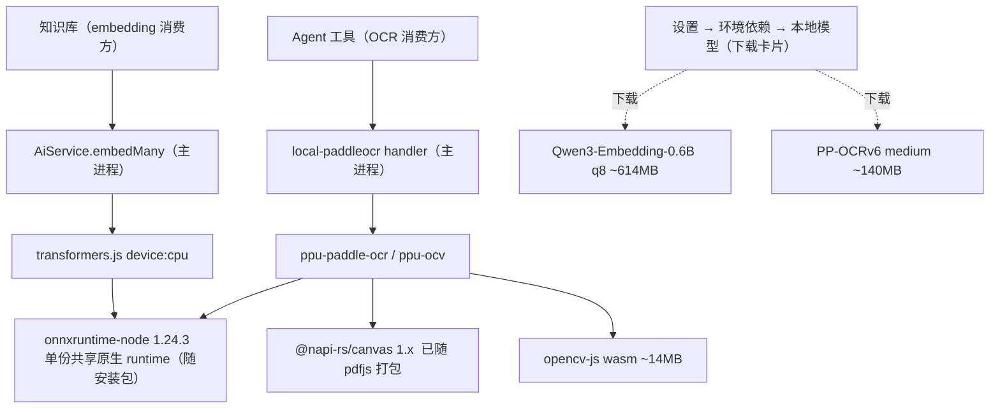

# RFC: 本地嵌入与 OCR — Qwen3-Embedding-0.6B + PaddleOCR v6 统一于 onnxruntime-node

> 定位：本地模型能力选型 RFC。提案新增**可选、本地**的两项能力——文本嵌入（服务知识库）与 OCR（**暴露为 agent 工具，与知识库无关**），
> 二者**统一运行在同一份 `onnxruntime-node` 原生 runtime** 上；框架二进制随安装包发布，**仅模型**经设置「环境依赖 → 本地模型」下载卡片按需下载。
>
> 目标是把选型结论、依赖/打包影响、实施拆分讲清楚，不作为逐文件实施清单。
>
> 配套飞书 RFC：`XpMzdaT0BoKcQ6xrYFbcwFcunke`（注：本 markdown 为活动版本，飞书版可能滞后）。
> 原始调研：研究报告 §3「本地 Embedding / Rerank 选型」`WCAzdZhyWoW5ObxVulEcqyFonSg`；
> 技术方案 §5.5（embedding/rerank 路由 AiService）`Q3yVd2TXHoP8pyxXIZZciiOlndg`。
> `v2-refactor-temp` 下的文档会在 v2 收尾时移除。
>
> 状态：草案 / 待评审 · 日期：2026-06-25 · 范围：本地嵌入（KB）+ 本地 OCR（agent 工具）+ 配套 PDF 依赖治理

---

## 1. 背景与动机

本 RFC 新增两项**可选的本地能力**，让用户无需配置任何远程 key、离线可用、数据不外发：（1）**文本嵌入**服务知识库（当前 embedding/rerank 已统一路由到 `AiService` → 远程 provider，见 #15796，本地路线与之并存）；（2）**OCR 暴露为 agent 工具**（与知识库无关，仅借用同一套本地 runtime 与下载机制）。

关键判断：OCR（`ppu-paddle-ocr`）与 embedding（transformers.js）的 JS 实现都依赖 `onnxruntime-node`。**两者统一到同一份 `onnxruntime-node`**——省去第二套推理引擎、原生 CPU 比 WASM 快得多，并与现有「主进程内 `embedMany`」架构天然契合。这一「统一」是本 RFC 的核心立论。

## 2. 目标与非目标

**目标**

- 本地文本嵌入（服务知识库）：`onnx-community/Qwen3-Embedding-0.6B-ONNX`，默认 dtype **q8**，经 transformers.js 在主进程 CPU 运行。
- 本地 OCR（暴露为 agent 工具）：PaddleOCR v6，经 `ppu-paddle-ocr` 运行，仅 `image_to_text`。
- 二者共用单份 `onnxruntime-node`，最小化新增二进制。
- **模型按需下载**：框架二进制（onnxruntime-node / transformers.js / ppu / opencv）作为普通依赖随安装包发布；**仅模型**经设置「环境依赖 → 本地模型」下载卡片按需下载，不进安装包。

**非目标**

- 不替换现有远程 provider 路线，二者并存。
- 不做本地 rerank（Qwen3-Reranker-0.6B 本地实测 ≈6s/次已 Pass，检索止于 hybrid RRF）。
- 不引入 GPU 专用 runtime / Python sidecar / Docker。
- OCR 不做 `document_to_markdown`（仅 `image_to_text`）；OCR 与知识库无关，不进 KB 图片 / 多模态管线。

## 3. 技术栈总览

三层结构：推理 runtime（`onnxruntime-node`，单份共享）→ 编排层（transformers.js / `ppu-paddle-ocr`）→ 业务调用（`embedMany` / 文件处理 OCR）。



## 4. 嵌入模型

### 4.1 选型

模型 `onnx-community/Qwen3-Embedding-0.6B-ONNX`，默认 dtype **q8（~614MB）**，经 **transformers.js**（`@huggingface/transformers` 4.2.0）以 `device:'cpu'` 在主进程 `onnxruntime-node` 上运行。transformers.js 把 `onnxruntime-node` 精确锁定在 `1.24.3`，与 OCR 共用同一份（见 §6.1）。其依赖 `sharp`（Cherry 已打包）+ `@huggingface/tokenizers`（纯 JS，无额外原生件）。

### 4.2 编排层备选与否决

推理 runtime（`onnxruntime-node`）已定，真正可选的是其上「分词 → 跑模型 → pooling → 归一化」的编排层。在**不破坏 onnxruntime-node 统一**的前提下：

| 方案 | 接 onnxruntime-node | 与 OCR dedupe | 结论 |
|---|---|---|---|
| **transformers.js** | 内置，pin 1.24.3 | ✅ | **主选**：开箱即用，调研按它设计 |
| DIY：onnxruntime-node 直调 + `@huggingface/tokenizers` | 自管版本 | ✅ | 备选：依赖最小、控制最强，自写 ~50 行预/后处理 |
| `fastembed@2.1.0` | pin onnxruntime-node 1.21.0 | ❌ 1.21.0≠1.24.3 装两份 | 出局：破坏 dedupe + 固定模型表无 Qwen3 |
| node-llama-cpp / Ollama / Python sidecar | 各自独立 runtime | ❌ | 出局：另起 runtime，违背统一 |

### 4.3 关键工程要点

- **必须用 ONNX community 仓库**：官方 safetensors 不能被 transformers.js 直接本地加载。
- **下载架构**（落地已偏离本节初稿，见下）：HF / ModelScope 镜像表（`modelSource.ts`），不硬编码 HF URL。
- **本地加载**：`env.allowRemoteModels=true`（worker 允许按需拉取，非纯离线本地），模型目录走 `application.getPath('feature.embedding.models')`（`pathRegistry` 已加该 key，集中式路径，不 ad-hoc 拼接）。
- **落地状态（已实现，替换本节"按 locale 选默认源"的初稿）**：镜像默认源改为 `regionService.isInChina()`（IP 出口地理位置），不是 UI locale——同一信号 `BinaryManager` 也在用，见 `localEmbeddingRuntime.ts` 的 `currentModelSource()`。
- **推理**：query 侧加 instruction 前缀（`Instruct: {task}\nQuery:{q}`），document 侧不加；**last_token pooling + L2 normalize**。
- **诚实提醒**：transformers.js 的 feature-extraction 原生 pooling 仅 `mean/cls/none`，**last_token 需 `pooling:'none'` 后手动取末 token + 归一化**——这段后处理 transformers.js 与 DIY 差距不大，落地先用固定样例对相似度趋势。

### 4.4 数据层注册与可见性

embedding **走 AI model/provider 注册**（OCR 不走，见 §5）。要让本地模型能被 `AiService.embedMany` → registry 解析（按 `providerId::modelId` PK），需写入：

- **1 行 `user_provider`**：本地 provider，建议独立 id `local-embedding`（或按框架 `transformers`）。
- **1 行 `user_model`**：`capabilities` 含 `EMBEDDING`，PK = `createUniqueModelId(providerId, modelId)`。

**uniqueModelId 约定**：分隔符是 `::`（`UNIQUE_MODEL_ID_SEPARATOR`），`modelId` 不能含保留路由字符 `?` / `#`：

```text
local-embedding::qwen3-embedding-0.6b
```

> ⚠️ **不要用 `cherryai_` 前缀**。cherryai 的 predicate（`isManagedCherryAiProviderId` / `isCherryAIProvider`）是**精确等于 `'cherryai'`**，`cherryai_local_embedding` 既不会继承 cherryai 的任何行为（managed / 隐藏），名字又误导。用独立 id 更干净。

**可见性（「模型列表不显示，模型选择要显示」）**：

- 字段已存在：`userModel.isHidden`（boolean，default false，"hidden from lists"）。给本地 embedding 行设 `isHidden: true`。
- **但当前 `isHidden` 仅 paintings picker 接线**；主 `ModelSelector`（`useModelSelectorData`）与 ProviderSettings/ModelList 都**不过滤** `isHidden`。
- 由此：模型选择器**天然就显示**（不看 `isHidden`）→「模型选择要显示」免费满足；要实现「模型列表不显示」需**给 ProviderSettings/ModelList 补一处 `!isHidden` 过滤**（小改动，复用现成字段）。
- `user_provider` **无 `isHidden`**（只有 `isEnabled`），本地 provider 仍会出现在 provider 设置列表；如需隐藏 provider 本身，单独扩展 `isCherryAIProvider` / `providerDisplay` predicate（与 model 隐藏正交）。

## 5. OCR（PaddleOCR v6）

### 5.1 选型：ppu-paddle-ocr

`ppu-paddle-ocr@6.0.0`：纯 TS、跨端，v3/v4/v5/v6 全系可切。模型用 **PP-OCRv6 medium**（det + rec ONNX，约 140MB），由 **app 从官方 PaddlePaddle 仓库**（`PaddlePaddle/PP-OCRv6_medium_{det,rec}_onnx`，HuggingFace / ModelScope 镜像 fallback）**按需下载到受管目录**——不走 ppu 自带的「首次运行下载 + 缓存」。字符字典官方 `*_onnx` 仓库未单独发布，改从识别模型的 `inference.yml`（`PostProcess.character_dict`）解析后写盘（格式须复刻 ppu 期望：开头 blank 槽 + 字符 + 结尾 space 槽）。`onnxruntime-node` 为 ppu 的 `peerDependency + optionalDependency`（范围 `^1.23.2`，⊇ 1.24.3）→ 与 embedding **dedupe 成单份**。连带 `ppu-ocv` → `@napi-rs/canvas`（已打包，见 §6.2）+ `@techstark/opencv-js`（wasm ~14MB，唯一真·净新增）。

**OCR 不进 model/provider 表，是 fileProcessing 的 `image_to_text` processor**（与 `tesseract` / `system` / `mistral` 平级，靠 `processorId` 注册）。本地 / 远程区分是现成的一等维度 `FileProcessorType = 'api' | 'builtin'`：

| processor | type | 性质 |
|---|---|---|
| `tesseract` / `system` / `ovocr` | `builtin` | 本地、进程内 |
| 现有 `paddleocr` | `api` | **远程 PaddleOCR API**（`createPaddleClient(apiHost, apiKey)`，已实现 image-to-text + document-to-markdown，已暴露 `modelId: PP-OCRv6`）|

> **本地 PaddleOCR 必须与现有远程 `paddleocr` 区分**，新增一个 `type: 'builtin'` 的独立 processor。命名跟 `mineru`(云) vs `open-mineru`(自托管) 的连字符限定词先例；因本地是**进程内、无网络**（非 `open-` 那种自托管 server），用 **`local-paddleocr`**。两者跑同代 PP-OCRv6，差别纯在执行方式（远程 API vs 本地进程内）。

### 5.2 备选与否决

| 方案 | runtime | 模型 | 结论 |
|---|---|---|---|
| **ppu-paddle-ocr** | onnxruntime-node ✅dedupe | PP-OCRv6 下载 | **主选**：最新、跨端、模型下载 UX 与 embedding 一致 |
| `@gutenye/ocr-node` | onnxruntime-node ✅dedupe | PP-OCRv4 打进 npm 包 +16MB | 备选：复用 sharp 零新增原生，但模型偏老、固定塞包 |
| `@paddle-js-models/ocr`（官方 Paddle.js） | WebGL 后端 ❌ | — | 出局：非 onnxruntime，无法统一 |

### 5.3 定位与引擎选用

- **定位**：本地 OCR **暴露为 agent 工具**，与知识库无关（不进 KB 图片 / 多模态管线）；在本 RFC 中只因与 embedding 共用 runtime + 下载机制而一并设计。
- **引擎选用（已定）**：多个 `image_to_text` 引擎（`system` / `tesseract` / 远程 `paddleocr` / `local-paddleocr` …）的优先顺序**交给用户决定**，UI 上可自定义默认；但**当用户在设置「环境依赖 → 本地模型」下载卡片下载了本地 PaddleOCR 模型，则自动把 `local-paddleocr` 设为默认**。

### 5.4 落地接线（新增 `local-paddleocr` processor）

镜像 `tesseract`（builtin）/ `paddleocr`（api）现有接线：

1. `FILE_PROCESSOR_IDS` 加 `'local-paddleocr'`（`src/shared/data/preference/preferenceTypes.ts`）。
2. `src/shared/types/ocr.ts` 加 `id: 'local-paddleocr'` 的 provider 类型，**config 去掉 `apiHost` / `accessToken`**，换本地相关（模型变体 / dtype / device）。
3. `src/shared/data/presets/fileProcessing.ts` 预设 record 加 `'local-paddleocr': { type: 'builtin', capabilities: [{ feature: 'image_to_text', inputs: ['image'], output: 'text', modelId: 'PP-OCRv6' }] }`。
4. 新建 `src/main/features/fileProcessing/processors/local-paddleocr/image-to-text/handler.ts` —— 走 **ppu-paddle-ocr 进程内**（镜像 tesseract 的 builtin handler 形状），不是 `createPaddleClient`；含模型下载 / 缓存管理。
5. i18n key `processor.local-paddleocr.name`。
6.（可选）`src/main/features/fileProcessing/config/defaultImageToTextProcessor.ts` 让 Linux 默认优先 `local-paddleocr`（现回退 `tesseract`）。

## 6. 统一 Runtime 与依赖治理

### 6.1 onnxruntime-node dedupe 矩阵

三者能否收敛成单份 `onnxruntime-node` 是「统一」成立的硬约束（npm 实测）：

| 来源 | onnxruntime-node 约束 | dedupe 到 1.24.3 |
|---|---|---|
| transformers.js 4.2.0 | 精确 pin `1.24.3` | ✅ 基准 |
| ppu-paddle-ocr 6.0.0 | peer+optional `^1.23.2` | ✅ |

**落地要求**：根 `package.json` 显式声明 `onnxruntime-node@1.24.3`，安装后 `pnpm why onnxruntime-node` 验证**仅单份**。

### 6.2 @napi-rs/canvas：已打包，需版本对齐

**关键发现**：`@napi-rs/canvas` 已是 Cherry 依赖（顶层 `dependencies` + `optionalDependencies` 全平台子包钉 `0.1.97`，与 sharp / libsql 一起为跨平台出包；Cherry 源码**零处直接 import**，纯由 PDF 栈间接拉入）。所以原生 skia **0 新增**。但 `ppu-ocv` 要 `^1.0.0` 而 Cherry 在 `0.1.97`（0.1 老线，不含）→ 须对齐到 1.x。**`@napi-rs/canvas` v1.0.0 官方明示「无破坏性改动，安全升级」**，0.1→1.0 仅为成熟度晋升。

### 6.3 PDF 依赖治理：升 pdfjs v6 + 移除 pdf-parse

> **⚠️ 尚未实现**：以下是设计阶段的决策，不是落地状态——`package.json` 里 `pdf-parse`/`pdfjs-dist`/`@napi-rs/canvas` 均未变动（对应 §9 PR-0 还未开始），见 §8 checklist 仍未勾选。
>
> **方案已定（推翻 `pnpm.overrides` 方案）**：不用 override 强压版本，而是从根上对齐——**移除 pdf-parse + 把 pdfjs-dist 升到 v6**。这样 canvas 消费者只剩 pdfjs@6（要 `^1.0.0`）与 ppu-ocv（`^1.0.0`），自然 dedupe 成单份 1.x，无需任何 override。

背景：`pdf-parse@2.4.5`（已是 latest）本质是 pdfjs 薄封装，却把 `@napi-rs/canvas` 硬钉 `0.1.80`，是阻断对齐的元凶；它在 Cherry 仅 `extractPdfText()`（`src/shared/utils/pdf.ts`）调 `getText()` 纯抽文本（IPC `Pdf_ExtractText` + AI PDF 兼容降级 `pdfCompatibility.ts`），**从不渲染**。

治理动作：

- **移除 pdf-parse**，`extractPdfText` 改用已装的 pdfjs `getTextContent` 重写（~40 行）。
- **pdfjs-dist 5.4.296 → 6.0.227**。v6 `[api-major]` 影响预览面板 `PdfPreviewPanel.tsx`：`getDocument({data})` 已传对象 ✅ 不受影响；但 `PDFDocumentProxy.destroy()` 被删 → 改用 `loadingTask.destroy()`（面板已在调）2~3 处；`PDFViewer` / `PDFLinkService` / `EventBus` 需完整冒烟。

> **⚠️ 此 PDF 治理与 OCR / embedding 主功能正交，建议单独成一个 PR**（含 viewer v6 迁移 + 预览冒烟），不与 OCR 功能混在同一 PR，避免无关风险扩散。

## 7. 打包与体积影响

框架二进制作为普通 `dependencies` 随安装包发布（electron-vite / electron-builder 正常打包），**仅模型经设置卡片按需下载**。各组件归属：

| 组件 | 类型 | 体积 | 交付方式 |
|---|---|---|---|
| onnxruntime-node 1.24.3（当前平台 CPU） | 原生 `.node` + `libonnxruntime` | 单平台 ~25–40MB | **随安装包**（`before-pack` 裁到目标平台） |
| transformers.js + tokenizer | JS | ~9.5MB | **随安装包** |
| @techstark/opencv-js | wasm（平台无关） | ~14MB | **随安装包**（经 ppu 传递依赖） |
| @napi-rs/canvas | 原生 skia | — | 已在安装包（PDF 用） |
| 模型（Qwen3 q8 / PP-OCRv6 medium） | 权重 | ~614MB / ~140MB | **按需下载**（设置「环境依赖 → 本地模型」卡片，分模型） |

**机制说明**：原计划「框架经扩展界面插件化下载、基础安装包零增量」**未采用**——onnxruntime-node / transformers.js / opencv 都作为普通依赖随安装包发布，只有模型走 `local_model.*` IPC + `LocalModelsSection` 下载卡片按需下载。因此安装包相对增大（onnxruntime-node 即便 `before-pack` 裁到目标平台，仍含其原生 runtime）。dedupe / canvas 版本对齐仍在**构建期**由单一 `package.json` 决定（§6 不变）。

## 8. 风险与验证 Checklist

- [ ] 固定 query/document 样例的 embedding 相似度符合模型卡趋势（验证 last_token + instruction 正确）。
- [ ] macOS / Windows / Linux 上模型下载 / 加载 / 取消 / 删除全流程。
- [ ] `pnpm why onnxruntime-node` 单份 1.24.3；`pnpm why @napi-rs/canvas` 单份 1.x。
- [ ] PaddleOCR v6 在三端的下载与识别（中文 / 版面 / 多语言）。
- [ ] PDF：移除 pdf-parse 后 `extractPdfText` 抽文本不回退；pdfjs v6 预览面板冒烟。
- [ ] 端到端：本地嵌入索引 + 检索闭环跑通。

## 9. 实施计划（建议分 PR）

| 阶段 | 内容 | 依赖 |
|---|---|---|
| PR-0（独立） | PDF 治理：移除 pdf-parse + pdfjs 升 v6 + canvas 对齐 1.x | 正交，可先行 |
| PR-1 | 模型下载服务（`LocalEmbeddingDownloadService` / `LocalOcrDownloadService` + `local_model.*` IPC）+ 设置「本地模型」下载卡片 UI；框架作为普通依赖随安装包 | — |
| PR-2 | transformers.js 本地 embedding provider（aiCore 扩展 + user_provider/user_model 注册 + `isHidden` + 路径 key） | 复用 PR-1 |
| PR-3 | `local-paddleocr` processor（ppu-paddle-ocr 进程内 handler + opencv-js + 模型下载 + 下载即设默认） | 复用 PR-1 |
| PR-4（小） | ProviderSettings/ModelList 补 `!isHidden` 过滤（本地 embedding 从模型列表隐藏、选择器仍显示） | 配套 PR-2 |

## 10. 待确认问题

产品决策已定：OCR = agent 工具（与 KB 无关）/ 框架随安装包、仅模型按需下载 / 引擎顺序用户定 + 下载即设默认 / 仅 `image_to_text` / 设置「本地模型」卡片下载 embedding + OCR / dtype = q8。剩余为落地前的实现细节：

- **框架交付方式（已定）**：放弃插件化下载 bundle，框架作为普通依赖随安装包发布；`before-pack` 仅把 onnxruntime-node 裁到目标平台。
- **`isHidden` 接线**：ProviderSettings/ModelList 补 `!isHidden` 过滤的落点；实测 KB 嵌入模型选择器确实显示 `isHidden` 模型。
- **last_token pooling 正确性**：transformers.js `pooling:'none'` + 手动取末 token，先用固定样例对相似度趋势。
- **`pnpm why` 实测**：`onnxruntime-node` 单份 1.24.3 + `@napi-rs/canvas` 单份 1.x。
- **PDF 治理 PR-0**：viewer v6 冒烟（`PDFDocumentProxy.destroy()` → `loadingTask.destroy()`）。
- **路径 key / 镜像（已定，已实现，见 §4.3）**：embedding = `feature.embedding.models`、OCR = `feature.ocr.paddleocr`；下载源走 HF / ModelScope 镜像表（`modelSource.ts`），按 IP 出口地理位置（`regionService.isInChina()`）选默认，不是 locale。

## 11. 参考

- 调研报告 §3「本地 Embedding / Rerank 选型」：`WCAzdZhyWoW5ObxVulEcqyFonSg`
- 技术方案 §5.5（embedding/rerank 路由 AiService）：`Q3yVd2TXHoP8pyxXIZZciiOlndg`
- 飞书 RFC（同内容）：`XpMzdaT0BoKcQ6xrYFbcwFcunke`
- ppu-paddle-ocr：<https://github.com/PT-Perkasa-Pilar-Utama/ppu-paddle-ocr>
- @napi-rs/canvas v1.0.0 release notes（无破坏性改动声明）
